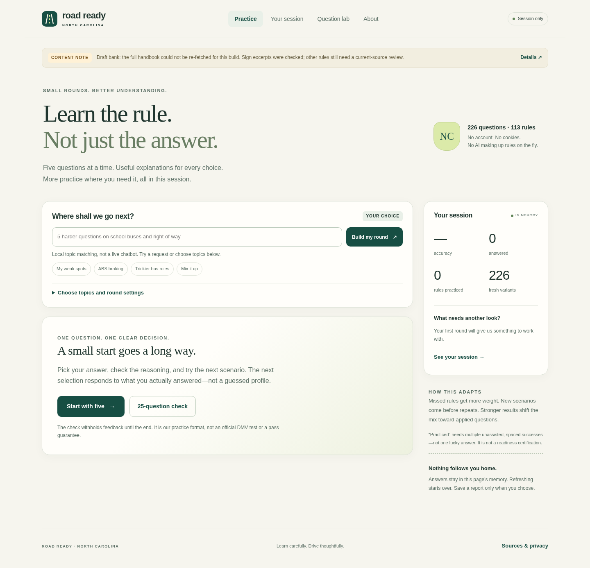

# Road Ready · North Carolina

A small-round, session-only driving-knowledge game. Learn a rule, understand the alternatives, and ask for a different direction. Built as a static project for `the-projects-i-tried`, with no backend, subscriptions, API keys, or tracking.

**Release status:** the application is implemented and tested, but the complete question bank is **not freshly source-certified**. This release includes **226 authored question variants across 113 rule families**. **44 sign questions** were checked against accessible official NCDOT sign sheets. **182 questions** adapted from the preceding handbook-based quiz conversation still need a current full-handbook review because the PDF could not be retrieved during this build. They are marked accordingly in the app. Do not present this release as an official or completely verified exam-preparation product. See [Sources](docs/SOURCES.md) and the [review queue](docs/CONTENT_REVIEW.md).



## Play locally

The compiled site is included. Open `site/index.html` in a modern browser; keep the `site` folder intact. No build step is necessary just to play. A local server is the most consistent option across browsers:

```sh
cd nc-road-ready
npm start
```

Open `http://127.0.0.1:8080`. Node.js 20 or newer is required for development scripts; Node 22 was used to test this release. **There are no npm dependencies to install.** Stop the server with Control-C. On macOS/Linux, `PORT=8081 npm start` selects a different port.

To make one fully self-contained file that can be emailed or opened offline:

```sh
npm run preview
# Creates road-ready.html in the repository root.
```

The standalone HTML and the hosted site have the same game, bank, and session-only behavior. Links to official sources still require an internet connection.

## What the game does

- **Five-question learning rounds.** Four single-select choices; each has its own explanation. Hint use is recorded separately from unassisted success. Answer positions are shuffled, not the underlying legal facts.
- **Within-session adaptation.** Missed rules receive more weight, recent rules get a cooldown, fresh scenarios come before repeats, and sustained correct answers shift selection toward harder scenarios. A 25-question check withholds feedback until the end; this is our practice format, not a claim about the precise DMV exam.
- **Topic requests and controls.** Type a short request or choose topic chips, difficulty, and round length. Narrow searches that run out of authored material say so rather than inventing rules or silently repeating questions.
- **An extensible question lab.** Export an authoring prompt, obtain source-grounded JSON from an assistant or human author, validate and preview it, then import it for the session. Add reviewed packs to the repository to make them available to everyone.
- **Inspectable content.** Browse rule summaries, follow source links, see review status, and prepare a local question-error report. The site contains original schematic sign illustrations, not copied official artwork.

A “practiced” label means two unassisted successes on distinct variants with intervening questions. It is a practice heuristic, not a calibrated mastery score or a prediction of passing an exam.

## Ask for another direction

Examples supported by the **local keyword/rule matcher**:

```text
5 harder questions on school buses and right of way
10 mixed questions, no signs
5 questions on my weak spots
5 questions on ABS
5 questions about headlights
more questions on roundabouts
review manual brake failure
```

This is not a live generative-AI chatbot. It selects from authored content. The interface displays how it interpreted the request; use the topic controls or rule library when an interpretation is too broad. Imported concepts with descriptive tags become discoverable through metadata matching.

Fresh-only mode is the default. “Review” explicitly permits old questions but still prioritizes unexposed variants. A new scenario may revisit an existing rule. Shuffled answer order does not count as a new question.

## Grow the bank

The initial bank is finite, but the format is open-ended. In **Question lab**, describe the desired new material and export a prompt. It includes the format, the existing questions to avoid, and only the answers actually given in this session. Give that prompt to an assistant with access to the current official handbook, review the resulting JSON, and import it.

Session imports disappear on refresh. To add a pack permanently:

```sh
npm run validate -- /path/to/my-pack.json --against-core
npm run add-pack -- /path/to/my-pack.json
npm run check
git add content/packs site/js/bank.js docs/CONTENT_REVIEW.md
git commit -m "Add source-reviewed practice scenarios"
git push
```

`add-pack` validates against the full current bank, rejects duplicates, and marks new material pending source review. Review the content before calling it source-checked. Structural validation cannot establish factual correctness. Full instructions: [Authoring](docs/AUTHORING.md), [example pack](docs/example-pack.json), and [JSON schema](content/pack-schema.json).

No API key belongs in this static public app. Real-time AI generation would require a separately designed secure service, cost controls, moderation, and stronger source verification; it is deliberately not included.

## Privacy

Answers exist only in JavaScript memory. There are **no cookies, localStorage, sessionStorage, account, analytics, service worker, or runtime API calls**. Refreshing or opening a new page starts a fresh session. Manual report/prompt downloads are user-controlled. Normal static-site host logs and outbound links remain outside the app's control. See [Privacy](docs/PRIVACY.md).

No prior conversation grades or personal details are bundled. A new visitor starts at zero.

## Publish under the organization

Follow [PUBLISH.md](PUBLISH.md). The included workflow deploys only `site/` to GitHub Pages. With repository name `nc-road-ready`, the expected project address after a successful deployment is:

```text
https://the-projects-i-tried.github.io/nc-road-ready/
```

It can be linked from the organization's shared front page; it does not need a separate `github.io` repository. `?embed=1` removes the outer header and footer for an iframe. No GitHub repository or deployment was created as part of this downloadable bundle.

## Development

```sh
npm run build       # Compile content/core.json + content/packs/*.json
npm run check       # Check generated bank and run all Node tests
npm run preview     # Build a single offline HTML file
```

```text
site/                 Static deployable app and original SVG illustrations
content/core.json     Authoritative built-in question data
content/packs/        Additional committed question packs
site/js/engine.js     Pure selection, session, parsing, and validation logic
site/js/app.js        Browser interface; no persistence or network calls
site/js/bank.js       Generated content bundle; do not hand-edit
scripts/              Dependency-free build, preview, validation, and server tools
tests/                Engine/content/distribution tests and optional browser smoke test
docs/                 Source review, architecture, authoring, privacy, QA
.github/workflows/    CI checks and project-site deployment
```

See [Architecture](docs/ARCHITECTURE.md), [Testing](docs/TESTING.md), and [Contributing](CONTRIBUTING.md). MIT license covers original code and authored material only; it does not relicense linked NCDOT publications. Road Ready is not affiliated with or endorsed by NCDOT or NCDMV.
